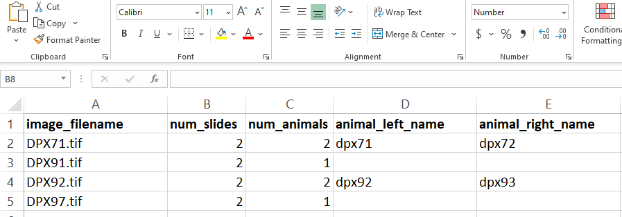
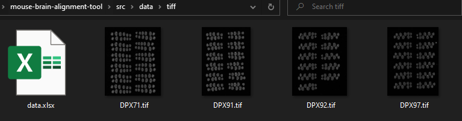
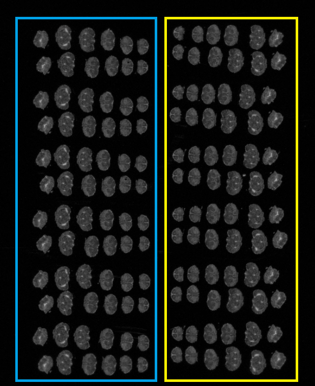
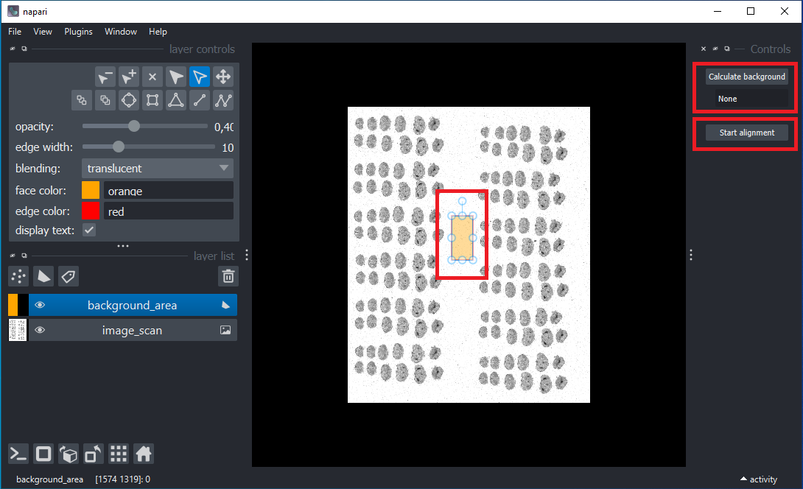
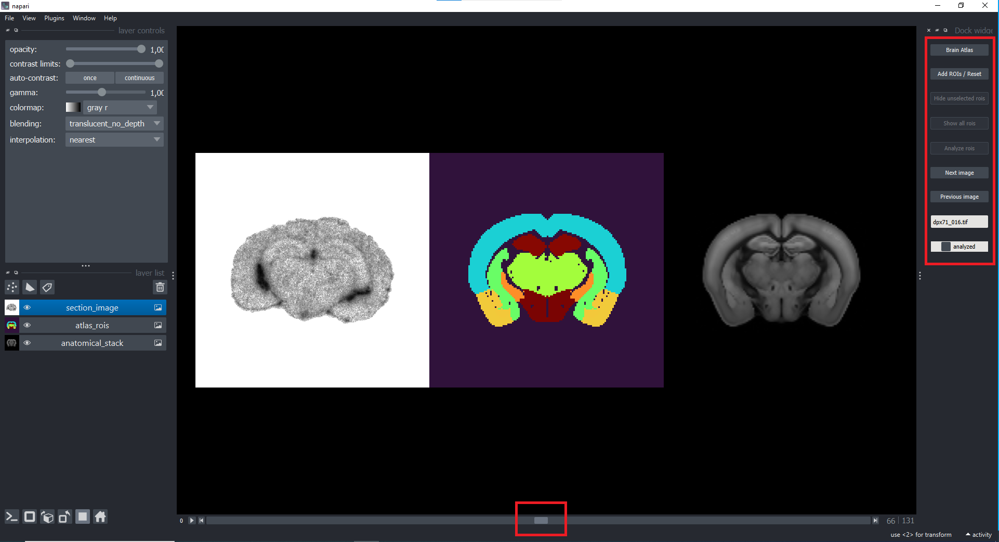
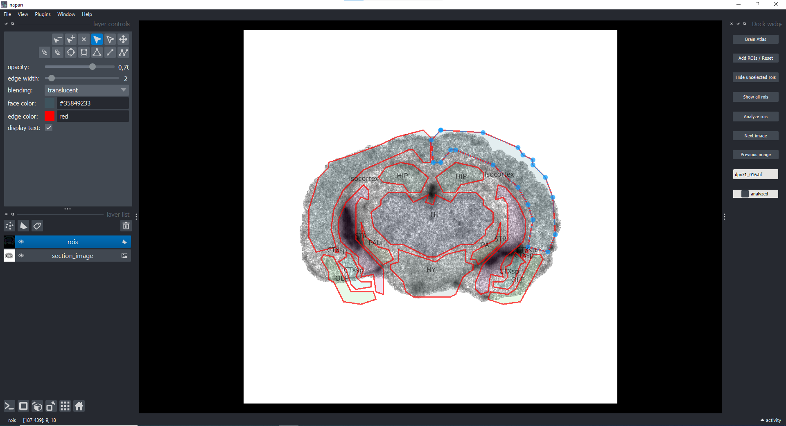

# User Documentation

Download a copy of the latest release through the [GitHub repository](https://github.com/Turku-BioImaging/mouse-brain-alignment-tool/releases) hosted by Turku BioImaging. Download and extract the release ZIP file into a folder of your choice. After extraction, there should be three files present:

- preprocess-_version-number_.exe
- analyze-_version-number_.exe
- data.xlsx

## Module 1 - Preprocessing

First here: how to set up images and excel.

### Input data

A single folder is required as input. This folder must contain any number of TIFF images and a single _data.xlsx_ file. Images must use the extension _\*.tif_, otherwise they will not be included in the preprocessing. The _data.xlsx_ is an Excel workbook that must follow a particular format. It includes the folowing columns:

- image_filename
- num_slides
- num_animals
- animal_left_name
- animal_right_name

  

<figure>
  
  <figcaption><em>Example of Excel data file</em></figcaption>
</figure>
  
  
<figure>
  
  <figcaption><em>Example contents of input folder</em></figcaption>
</figure>
  
  
For every image, if the column *num_animals* has a value of _1_, then the columns *animal_left_name* and *animal_right_name* must be blank. If the column *num_animals* has a value of _2_, then the preprocessing tool assumes a column of slides in the input images to be from the same animal (see image below). A copy of the Excel template is located [here](excel_template.xlsx).

  

<figure>
  
  <figcaption><em>How the tool differentiates between animals</em></figcaption>
</figure>

### Expected output

### Usage

Double-click on **preprocess-0.2.2.exe** to open the preprocessing interface (this can take up to a minute). After the preprocess window is open, select the source directory (the folder containing images and the prepared Excel sheet _data.xlsx_). Select the output directory, as where do you wish the preprocessed data to be saved to. Click run to start the preprocess.  
**IMPORTANT:** The Excel document should not be open while the preprocess app is running!

---

Select the directory where your images and data.xls file are. Select the folder where you want the preprocessed images to appear as output directory.
Depending on data size, the preprocess can take longer time. Process can be tracked from running log, where all processed images will be marked, as well as the completion of preprocessing.
In the output folder, there will be a separate folder for each image, with a name corresponding to image_filename. The folder will contain separate subfolders for each animal in the image. These subfolders will contain sections folder, the tiff folder that contains original .tif file as well as QC folder. Sections folder contains all the sections of the brain as separate .tif files, while QC (quality control) folder contains a PDF document with raw image, rotated slices and documented slices.

## Module 2 - Analysis

This module provides a graphical interface where preprocessed ARG brain sections can be matched to anatomical atlas sections and their intensity analyzed. Regions-of-interest (ROIs) pertaining to specific brain regions from the anatomical atlas can be manually registered to fit the ARG image. Average intensities of individual ROIs can then be measured and saved in a data file.

There is no need for the user to analyze all image sections. Analyzed data is stored in a CSV data file that is automatically reloaded whenever the app is opened.

### Input data

This module accepts input data generated from _Module 1 - Preprocessing_. A single folder named _sections_ must be selected containing TIFF section images. Alternatively, the user can, within the _sections_ folder, create subfolders where section TIFFs can be copied. These subfolders can be loaded invidividually into the app. NB! Choosing a higher level folder than the _sections_ will result in an error message and the analysis module crashing, forcing the user to restart the module.

</img>  
_Example contents of sections folder used as input._

### Expected output

### Usage

</img>  
_Module 2 data selection interface_

Select a _sections_ folder to be analyzed and click _Continue_ to open the image analysis graphical user interface. The module will automatically open the original source image with a box for analyzing background signal level. This is done simply by moving the box to an area without signal from a sample and clicking _Calculate background_ on the right upper corner. The background signal value appears in the box under the button. The size and shape of the box for setting the background is freely adjustable.
After the background is set click _Start alignment_ to start matching ROIs to individual brain slices. The background signal is automatically deducted from the analyzed ROIs in the results-file. NB! The background signal value is not recorded on the results-file.

  

<figure>
  
  <figcaption><em>Module 2 Image analysis interface for setting background</em></figcaption>
</figure>

  
Next the sectioned sample brain slice image, ROI map and anatomical reference image are all displayed side by side. Using the slider at the bottom the user can toggle through the reference images and choose the best match for the sample brain slice. A reference image from the middle of the brain is displayed by default. Once the corresponding anatomical reference image for the sample brain slice image has been found, the ROIs are overlayed by clicking _Add ROIs / Reset_.

  

<figure>
  
  <figcaption><em>Matching ROIs / anatomical reference with the sample slice</em></figcaption>
</figure>

  
The user can now move the ROIs to better match the sample. Using the layer control options on the upper left of the window, the ROIs can be freely moved (_Select shapes_, drag with mouse) and adjusted (_Select vertices_, drag blue dots with mouse). Unnecessary ROIs can be hidden using the controls on the right or deleted alltogether. Clicking _Add ROIs / Reset_ will reset all the ROIs back to the original position from the anatomical reference. Clicking _Brain atlas_ will bring the user back to the anatomical reference image selection. After the user is satisfied with the ROI matching, clicking _Analyze rois_ will upload results to a cvs-file in the subject folder (where the sections-folder is). A checkmark will appear in the bottom box on the right to indicate that the slice has been previously analyzed. The checkmarks will appear for slices that are already analyzed even if the module is closed and reopened: if the sample slice is re-analyzed, the previous data will be overwritten.

  

<figure>
  
  <figcaption><em>Manually finetuning ROI matching for analysis</em></figcaption>
</figure>

  
